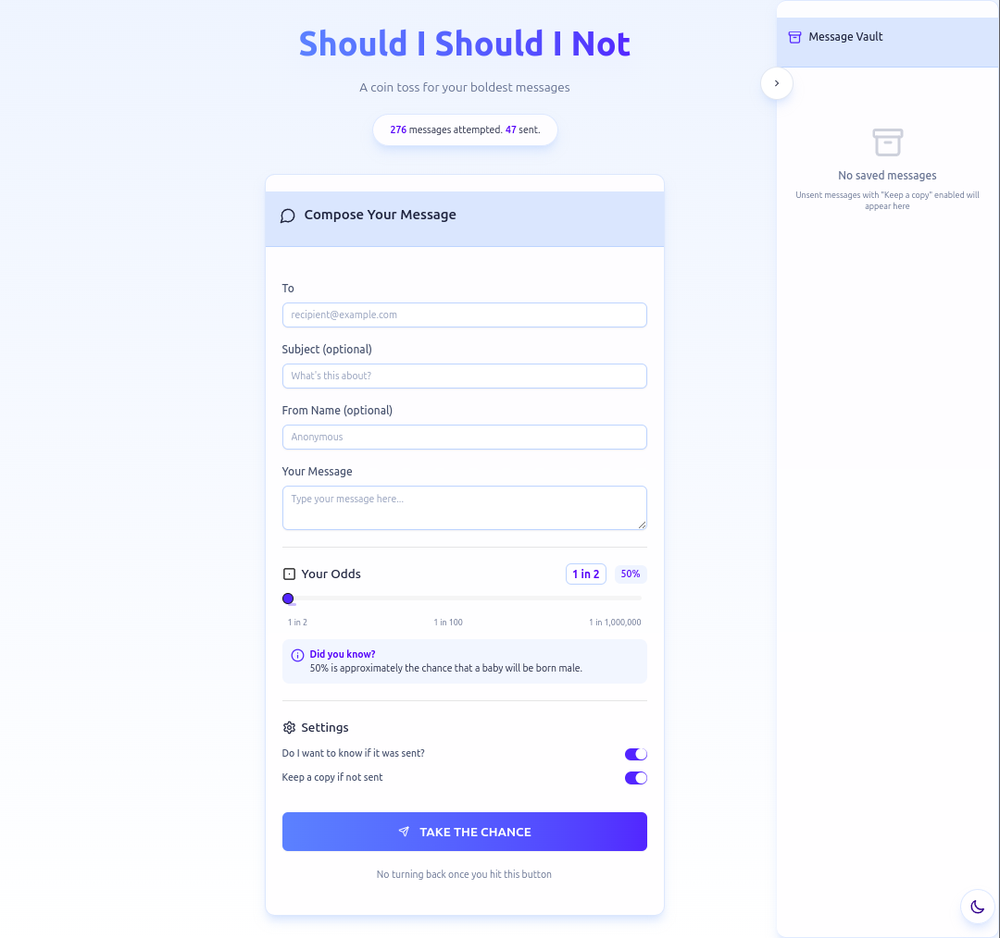
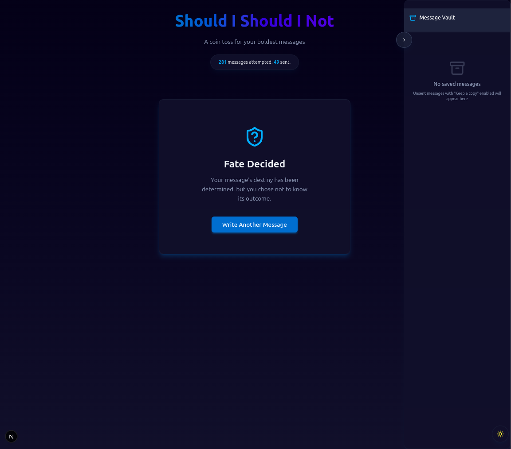
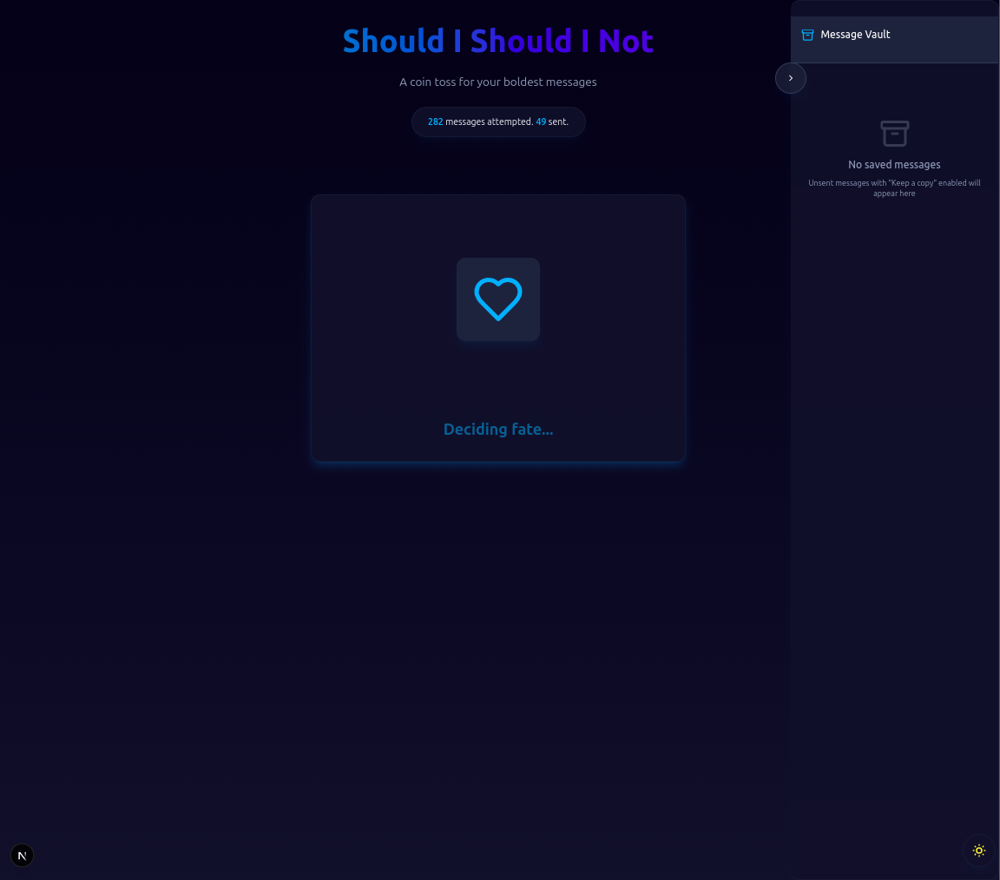
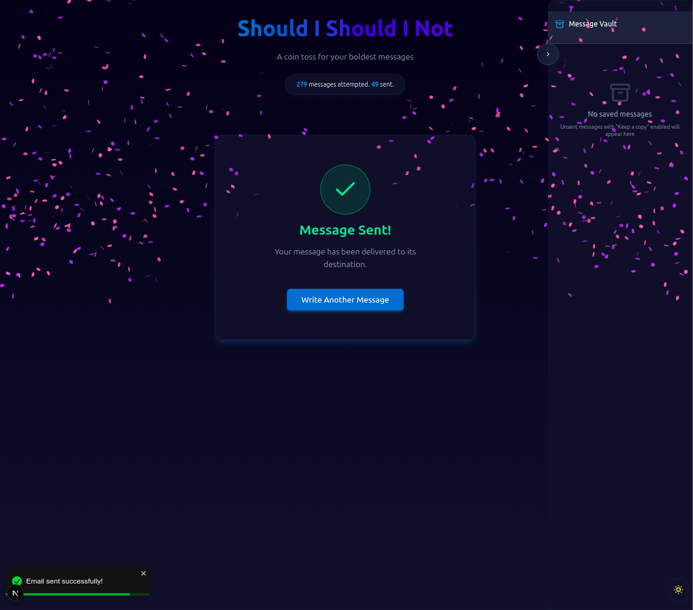
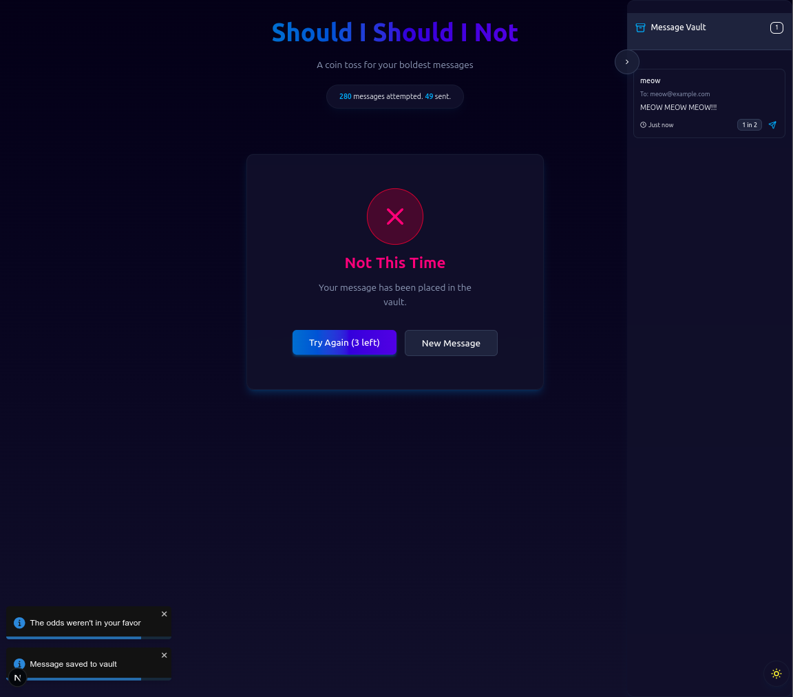
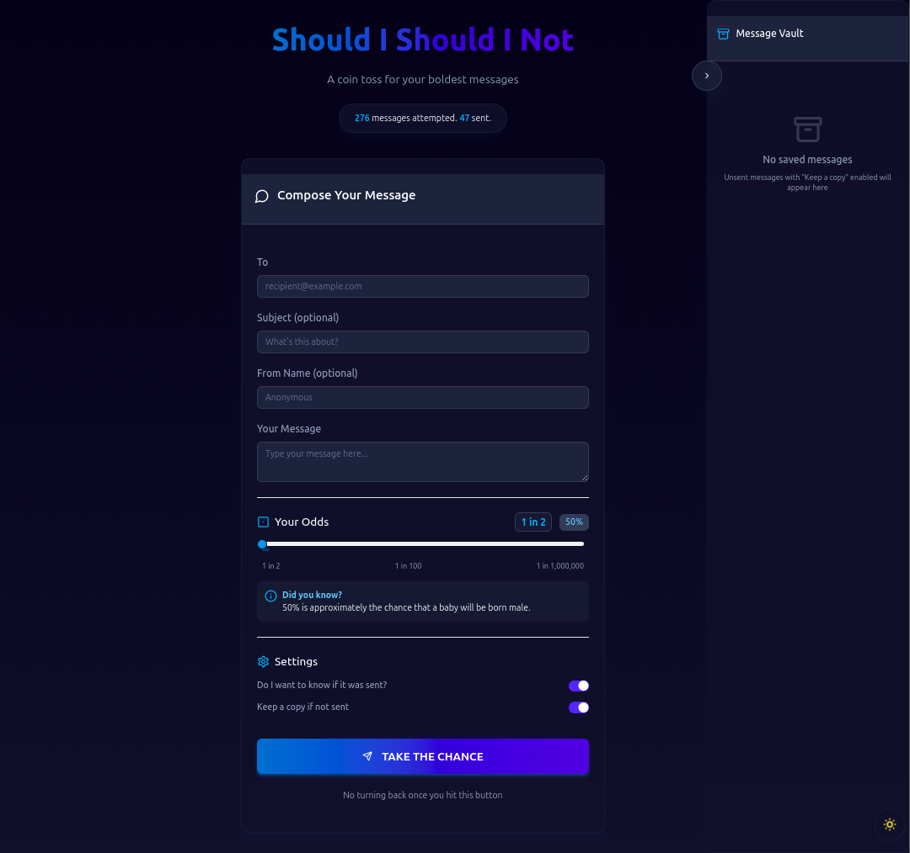

# <div align="center" style="font-size:50px;">Should I Should I Not?</div>

<div align="center" style="margin-bottom: 20px;">Welcome to <b>Should I Should I Not?</b> — a fun and suspense-driven messaging app built with <b>Next.js</b>.<br>
Control the odds of your message actually being sent. Perfect for risky texts, bold confessions, or just a bit of chaos.</div>

<p align="center">
  
  
</p>

<p align="center"><strong>📊 Will your message be sent? You set the odds. Let fate decide.</strong></p>

---

## 🎯 Features

- 🎲 **Custom Probability**: Set your own odds — from 1 in 2 to 1 in 1,000,000
- 💬 **Compose View**: Full message form (To, Subject, Message)
- 🗂 **Message Vault**: Store unsent messages for future attempts
- 🔁 **Retry System**: Up to 3 attempts per message
- ⏳ **Cooldown Mechanism**: Prevents spammy reattempts
- 🌗 **Dark/Light Mode**: Theme toggle for vibes
- 🎉 **Confetti Animation**: When your message hits the jackpot
- 📈 **Stats Panel**: Tracks total attempts vs. successful sends

---

## ⚙️ Installation

```bash
git clone https://github.com/MishanPoudel/should-i-should-i-not.git
cd should-i-should-i-not
npm install
```

Create a `.env` file by copying the example:

```bash
cp .env.example .env
```

Then, open `.env` and fill in your actual API credentials:

```env
EMAIL_SERVICE_API_KEY=your_actual_key
EMAIL_SERVICE_URL=your_actual_url
...
```

Run the dev server:

```bash
npm run dev
```

Your app will be live at [http://localhost:3000](http://localhost:3000)

---

## 🧪 Usage

- Write your message
- Set the delivery odds
- Click “Send” and let the RNG gods decide
- If it fails, check the Message Vault and retry (3 tries max)
- Cooldowns apply for repeated recipients

---

## 🛠 Tech Stack

- **Next.js** – React framework for building the UI
- **Tailwind CSS** – Utility-first styling
- **Framer Motion** – Page + element animations
- **Firebase** – Stats & basic backend
- **UUID** – Unique message IDs
- **Local Storage** – Saves unsent messages locally
- **React Toastify** – Notifications

---

## 🤝 Contributing

Fork. Create a feature branch. Commit with clean messages. PR. Boom.  
Please follow the existing code style and add comments where needed.

---

## ⭐ Support

Found it fun? Star the repo on GitHub — it fuels the motivation!  
[GitHub Repo](https://github.com/MishanPoudel/should-i-should-i-not)

---

## 📬 Contact

Questions or ideas?  
📧 [poudelmishan2@gmail.com](mailto:poudelmishan2@gmail.com)

---

## 📸 Screenshots

<p align="center">
  
  
  
  
  
</p>

---

## 💡 Inspiration

The idea? Built for indecisive people who overthink pressing “Send.” 
Inspired by chaotic decision-making, gambling mechanics, and just a little bit of ✨drama✨.

<p align="center">
  
</p>

<div align="center" style="margin-top:20px;"><strong>Go ahead. Spin the wheel. Send the message. 🎲📩</strong></div>
